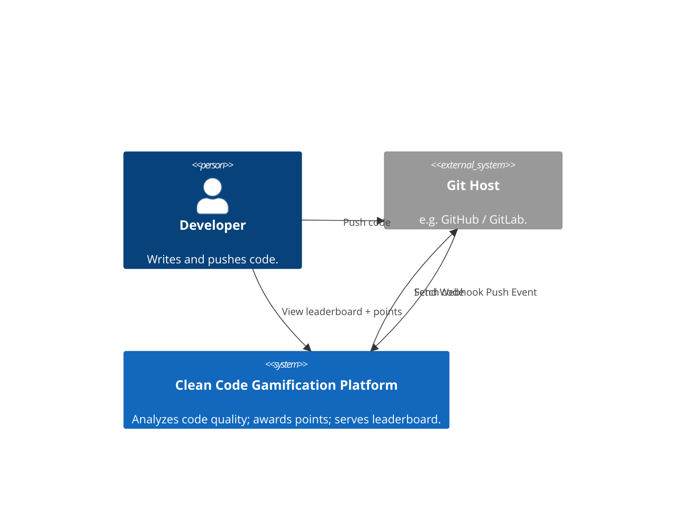
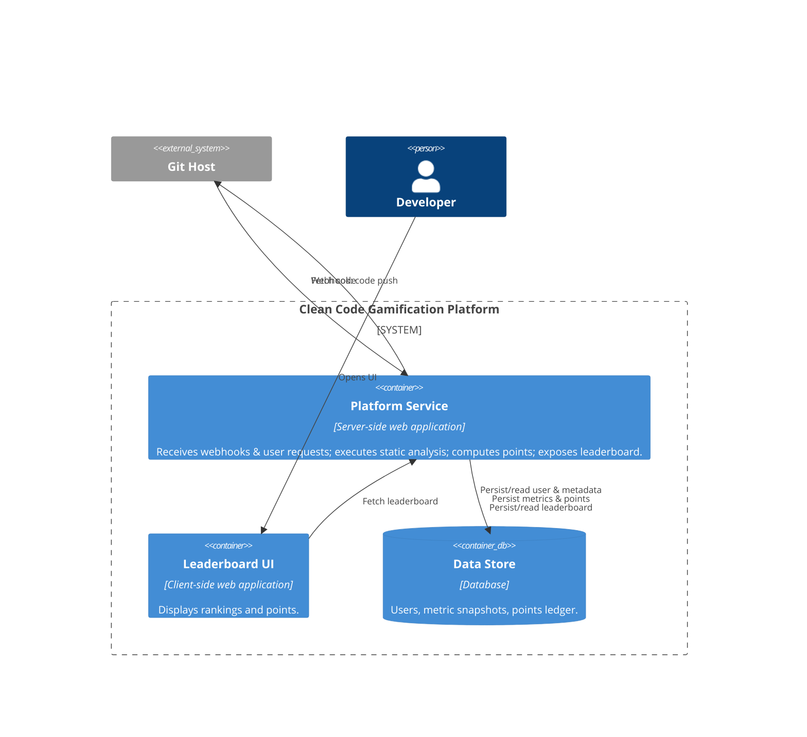
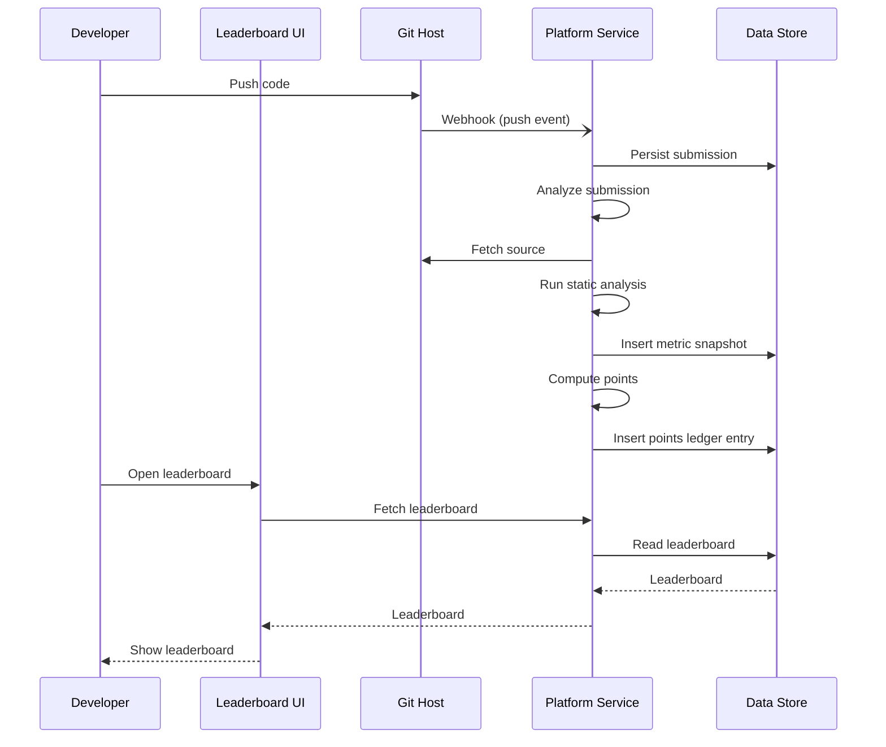
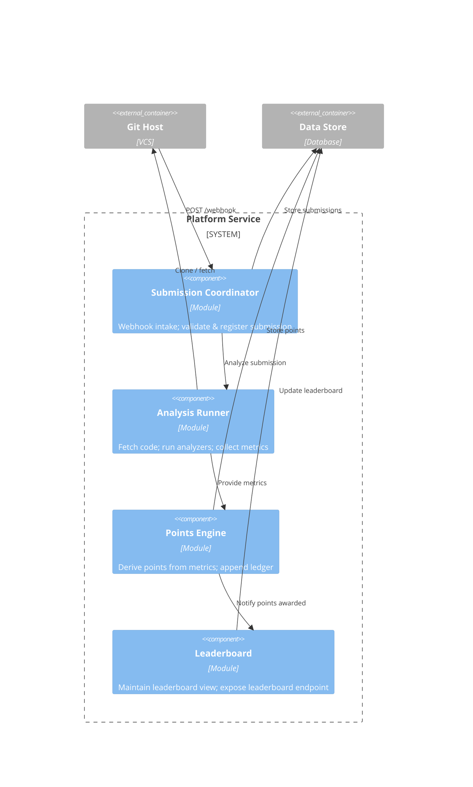

# 🧪 Con-SOLID-Ate – Clean Code Gamification Platform (Backend)

A backend component of a **clean-code gamification platform** designed to analyze code submissions, award points for adherence to SOLID principles, and maintain a leaderboard of developers.
This repository contains the **server-side platform service** — the core logic, API endpoints, analysis pipeline, and leaderboard projection. It does **not** include the frontend UI.

---

## 📚 Table of Contents

1. [Overview](#overview)
2. [Functional Requirements](#functional-requirements)
3. [Non-Functional Requirements](#non-functional-requirements)
4. [System Design](#system-design)

    * [C4 Level 1 – System Context](#c4-level-1--system-context)
    * [C4 Level 2 – Container Diagram](#c4-level-2--container-diagram)
    * [Sequence Diagram – Submission Flow](#sequence-diagram--submission-flow)
    * [C4 Level 3 – Component Diagram](#c4-level-3--component-diagram)
5. [Deployment](#deployment)
6. [Usage](#usage)

---

## 📦 Overview

**Con-SOLID-Ate** is a backend service that enables developers to submit code (via Git push) for automated static analysis.
The system evaluates code quality, checks adherence to SOLID principles, awards points, and maintains a global leaderboard.

🚧 *This MVP version does not include peer reviews, badges, certificates, notifications, or admin extensibility.*

---

## ✅ Functional Requirements

1. **Code Submission & Intake**

    * Accept code submissions via Git webhook.
    * Support multiple languages and frameworks.
    * Version code submissions and track history per user.
2. **Automated Static Analysis**

    * Run static analysis on submitted code.
    * Evaluate maintainability, complexity, duplication, and SOLID violations.
    * Store raw metrics and results per submission.
3. **Points System**

    * Award points for clean code and SOLID compliance.
    * Maintain a points ledger per user.
4. **Leaderboard & Progress Tracking**

    * Display global leaderboard.
    * Show user progress and recent achievements.

---

## 📈 Non-Functional Requirements

| Category           | Requirement                                                                                 |
| ------------------ | ------------------------------------------------------------------------------------------- |
| **Availability**   | Core API and scoring pipeline ≥ 99.5% uptime.                                               |
| **Performance**    | Median analysis completion < 2 min for small projects. Leaderboard query p95 < 250 ms.      |
| **Scalability**    | Support 100 concurrent analysis jobs and 50 concurrent UI requests. Designed for 500 users. |
| **Security**       | OAuth2/OIDC authentication. Secrets encrypted.                                              |
| **Observability**  | Tracing, metrics (analysis duration, queue depth, error rate), structured logs.             |
| **Data Retention** | Metrics and scores stored for 12 months. GDPR erasure workflow supported.                   |

---

## 🧱 System Design

### C4 Level 1 – System Context



When a developer pushes code, the Git host sends a webhook to the platform.
The platform fetches the code, analyzes it, awards points, and updates the leaderboard.
Developers view rankings and points through the frontend UI.

---

### C4 Level 2 – Container Diagram

> [!NOTE]
> In the [C4 model](https://c4model.com/abstractions/container), a *Container* represents a deployable application or data source, **not** a Docker container.



---

### Sequence Diagram – Submission Flow



---

### C4 Level 3 – Component Diagram



---

## 🚀 Deployment

This project is a standard **Spring Boot** backend and can be deployed as a standalone service or within your existing backend ecosystem.

### 🧰 Prerequisites

* Java 17+
* Maven 3.8+

### 🏗️ Build and run locally

```bash
mvn spring-boot:run
```
or 
```bash
mvn clean package
java -jar target/con-solid-ate-1.0.0.jar
```

The service will start on `http://localhost:8080`.

---

## 📡 Usage

### 1. Simulate a Git webhook (code submission)

```bash
curl -X POST http://localhost:8080/webhook/github \
  -H "Content-Type: application/json" \
  -d '{"userId":"u1","repoUrl":"https://github.com/acme/repo","branch":"main"}'
```

✅ Expected: submission stored, analysis triggered, points awarded, leaderboard updated.

---

### 2. Retrieve the leaderboard

```bash
curl http://localhost:8080/leaderboard
```

✅ Expected: JSON list of users and their scores.

---

### 3. H2 console (for debugging)

Visit: [http://localhost:8080/h2-console](http://localhost:8080/h2-console)
JDBC URL: `jdbc:h2:mem:cons`

---

## 🧠 Notes for Users

* This is the **backend** component of Con-SOLID-Ate. It exposes REST APIs and internal processing logic.
* A frontend UI can be integrated separately to display leaderboards and user progress.
* The MVP intentionally excludes peer reviews, badges, notifications, and admin configuration — these are planned as future extensions.

---

Would you like me to now generate a **matching `README.md` for the GOOD version** (the refactored architecture), too — so you have them side by side for the workshop? (It’s often powerful to compare them.)
