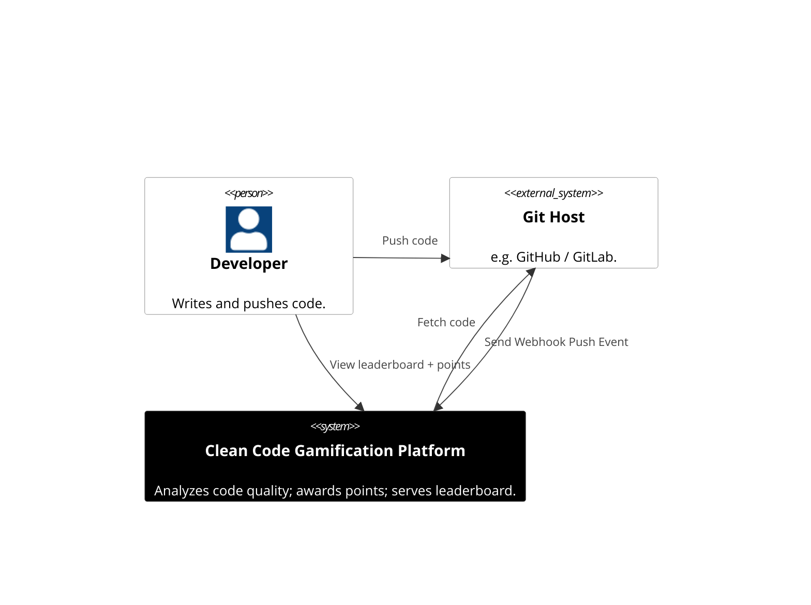
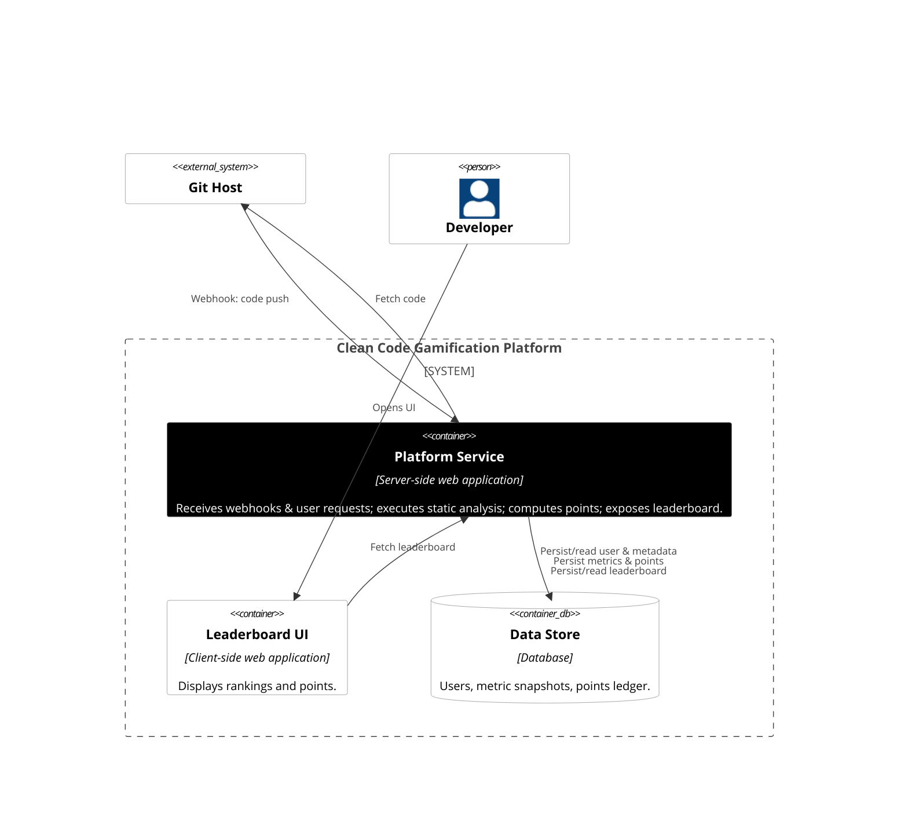
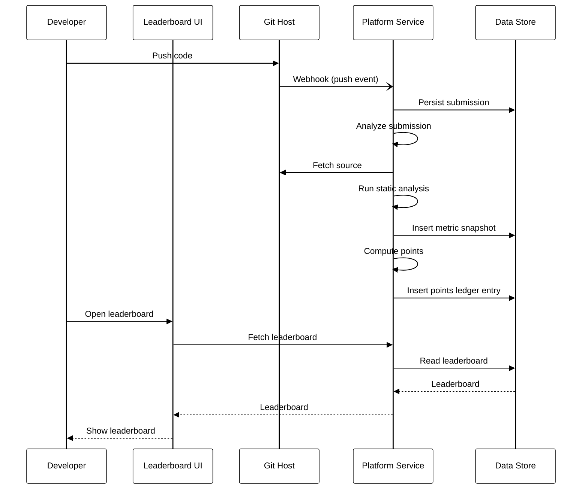
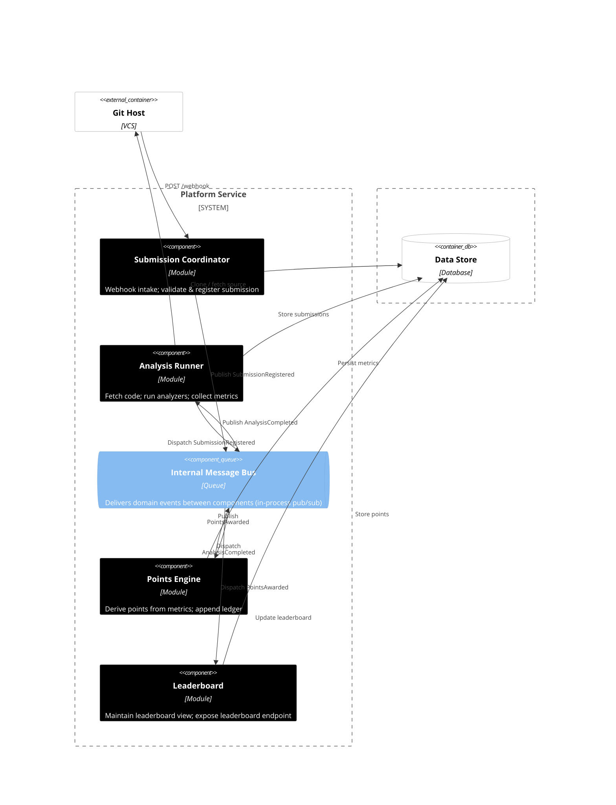

# 🧪 Con-SOLID-Ate - Clean Code Gamification Platform (Backend)

A backend component of a **clean-code gamification platform** designed to analyze code submissions, award points for adherence to SOLID principles, and maintain a leaderboard of developers.
This repository contains the **server-side platform service** - the core logic, API endpoints, analysis pipeline, and leaderboard projection. It does **not** include the frontend UI.

---

## 📚 Table of Contents

1. [Overview](#overview)
2. [Functional Requirements](#functional-requirements)
3. [Non-Functional Requirements](#non-functional-requirements)
4. [System Design](#system-design)

   * [C4 Level 1 - System Context](#c4-level-1--system-context)
   * [C4 Level 2 - Container Diagram](#c4-level-2--container-diagram)
   * [Sequence Diagram - Submission Flow](#sequence-diagram--submission-flow)
   * [C4 Level 3 - Component Diagram](#c4-level-3--component-diagram)
5. [Code Structure and Package Overview](#code-structure-and-package-overview)
6. [Deployment](#deployment)
7. [Testing](#testing)
8. [Usage](#usage)

---

## <div id="overview">📦 Overview</div>

**Con-SOLID-Ate** is a backend service that enables developers to submit code (via Git push) for automated static analysis.
The system evaluates code quality, checks adherence to SOLID principles, awards points, and maintains a global leaderboard.

🚧 *This MVP version does not include peer reviews, badges, certificates, notifications, or admin extensibility.*

---

## <div id="functional-requirements"> ✅ Functional Requirements

1. **Code Submission & Intake**

   * Accept code submissions via Git webhook.
   * Support multiple languages and frameworks.
   * Version code submissions and track history per user.
2. **Automated Static Analysis**

   * Run static analysis on submitted code.
   * Evaluate maintainability, complexity, duplication, and SOLID violations.
   * Store raw metrics and results per submission.
3. **Points System**

   * Award points for clean code and SOLID compliance.
   * Maintain a points ledger per user.
4. **Leaderboard & Progress Tracking**

   * Display global leaderboard.
   * Show user progress and recent achievements.

---

## <div id="non-functional-requirements">📈 Non-Functional Requirements

| Category           | Requirement                                                                                 |
| ------------------ | ------------------------------------------------------------------------------------------- |
| **Availability**   | Core API and scoring pipeline ≥ 99.5% uptime.                                               |
| **Performance**    | Median analysis completion < 2 min for small projects. Leaderboard query p95 < 250 ms.      |
| **Scalability**    | Support 100 concurrent analysis jobs and 50 concurrent UI requests. Designed for 500 users. |
| **Security**       | OAuth2/OIDC authentication. Secrets encrypted.                                              |
| **Observability**  | Tracing, metrics (analysis duration, queue depth, error rate), structured logs.             |
| **Data Retention** | Metrics and scores stored for 12 months. GDPR erasure workflow supported.                   |

---

## <div id="system-design">🧱 System Design</div>

### <div id="c4-level-1--system-context">C4 Level 1 - System Context</div>



When a developer pushes code, the Git host sends a webhook to the platform.
The platform fetches the code, analyzes it, awards points, and updates the leaderboard.
Developers view rankings and points through the frontend UI.

---

### <div id="c4-level-2--container-diagram">C4 Level 2 - Container Diagram</div>

> [!NOTE]
> In the [C4 model](https://c4model.com/abstractions/container), a *Container* represents a deployable application or data source, **not** a Docker container.



---

### <div id="sequence-diagram--submission-flow">Sequence Diagram - Submission Flow</div>



---

### <div id="c4-level-3--component-diagram">C4 Level 3 - Component Diagram</div>



---

### <div id="code-structure-and-package-overview">🧩 Code Structure and Package Overview</div>

The Con-SOLID-Ate backend follows a **layered modular design**, where each package represents a domain module or a shared cross-cutting concern.  
This section provides an overview of the source code layout and explains the purpose of each part of the system.

```
src/
├── main/
│   ├── java/edu/architecture/modularmonolith/consolidate/
│   │   ├── submission/             # Manages submission lifecycle and metadata
│   │   ├── analysis/               # Executes static analysis jobs and collects metrics
│   │   ├── points/                 # Calculates points and maintains points ledger
│   │   ├── leaderboard/            # Aggregates and serves leaderboard data
│   │   ├── shared/                 # Cross-cutting utilities  
│   │   └── ConSolidAte.java        # Main Spring Boot entry point
│   └── resources/
│       ├── application.properties  # Application configuration
│       └── schema.sql              # Database schema definition
└── test/
    └──groovy/                      # End-to-end Spock BDD tests
````
Each module package contains two sub-packages:
- **api** - represents module public interface that can be levaraged by other modules
- **internal** - represents module

---

## <div id="deployment">🚀 Deployment</div>

This project is a standard **Spring Boot** backend and can be deployed as a standalone service or within your existing backend ecosystem.

### 🧰 Prerequisites

* Java 17+
* Maven 3.8+

### 🏗️ Build and run locally

```bash
mvn spring-boot:run
```
or
```bash
mvn clean package
java -jar target/con-solid-ate-1.0.0.jar
```

The service will start on `http://localhost:8080`.

---

## <div id="testing">🧪 Testing</div>

### Framework

All automated tests in **Con-SOLID-Ate** are written using the **[Spock Framework](https://spockframework.org/)** - a BDD-style testing framework for Groovy.
Spock tests follow the expressive `given / when / then` structure, enabling behavior-driven verification of both module and end-to-end scenarios.

Each test class uses:

```groovy
@SpringBootTest(webEnvironment = RANDOM_PORT)
```

which means that:

* the **entire Spring ApplicationContext** is started for every test,
* all real beans and configurations are loaded (unless explicitly overridden),
* tests execute against the same runtime setup as the production backend.

This approach ensures realistic verification of how modules interact within the running monolith.

---

### Running Tests

To execute all tests:

```bash
mvn clean test
```

Each test suite starts its own Spring context instance and performs real HTTP calls through `TestRestTemplate` to validate application behavior.

---

### Test Reports

After successful test execution, HTML reports are automatically generated under:

```
target/spock-reports/
├── summary.html
└── SomeUseCaseTest.html
```
When running tests in IntelliJ, report can be displayed in a built-in local WebStorm server:
  ```
  http://localhost:63342/peap-priv-modular-monolith-workshop/target/spock-reports/summary.html
  ```
---

##  <div id="usage"> 📡 Usage </div>

### 1. Simulate a Git webhook (code submission)

```bash
curl -X POST http://localhost:8080/webhook/github \
  -H "Content-Type: application/json" \
  -d '{"userId":"marcin","pullRequestUrl":"https://github.com/workshop/con-solid-ate/pull/1"}'
```

✅ Expected: submission stored, analysis triggered, points awarded, leaderboard updated.

---

### 2. Retrieve the leaderboard

```bash
curl http://localhost:8080/leaderboard
```

✅ Expected: JSON list of users and their scores.

---

### 3. H2 console (for debugging)

Visit: [http://localhost:8080/h2-console](http://localhost:8080/h2-console)
JDBC URL: `jdbc:h2:mem:cons`

---
