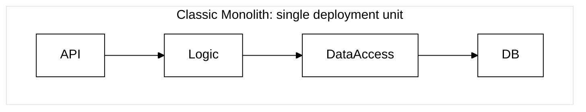
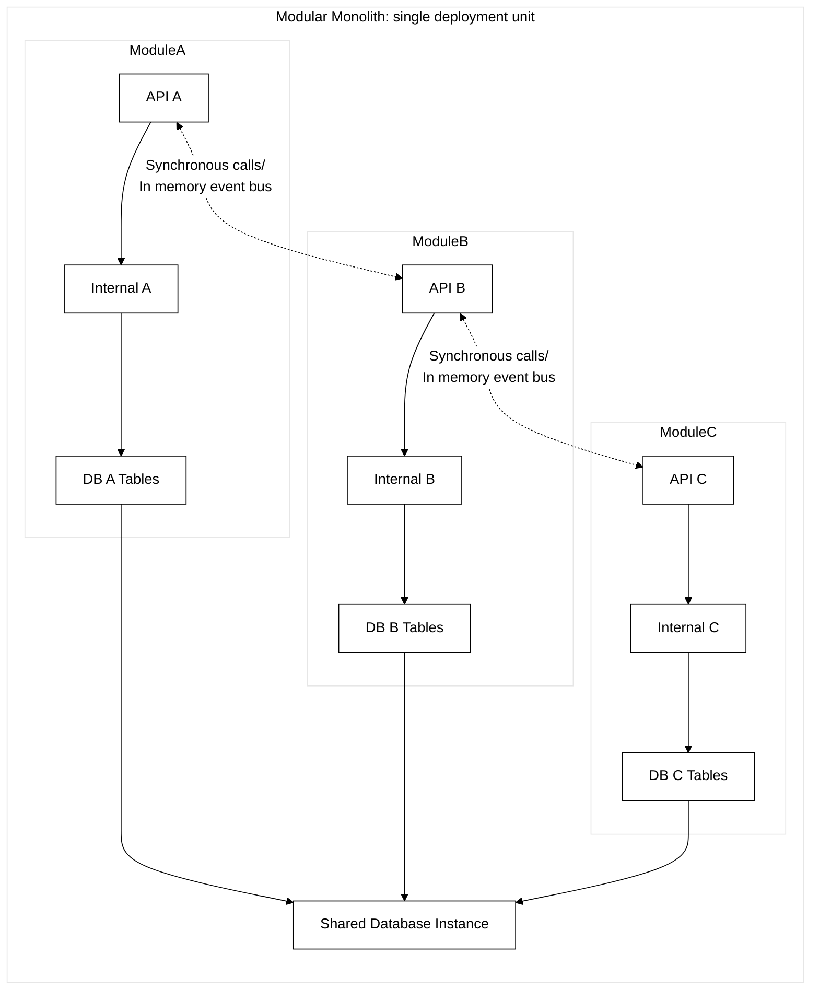
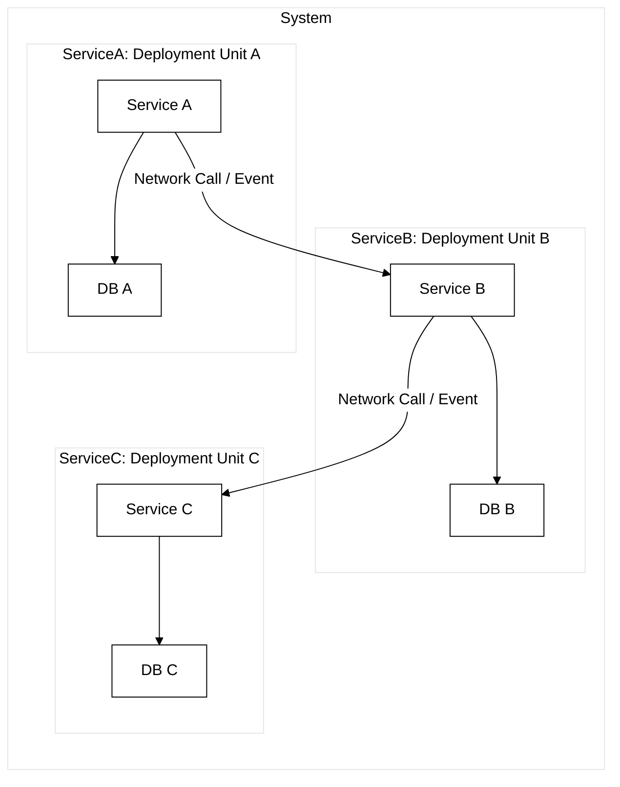

# 🗺️ Architecture Spectrum: System Evolution

There's no single "best" style. It's a spectrum of choices and trade-offs.

##  The Differences

**Classic Monolith:** One large codebase, often with tangled dependencies. One deployment unit.

**Modular Monolith:** Codebase organized into distinct modules with enforced internal boundaries (APIs/Events). Still one deployment unit.

**Microservices:** Each service is a separate deployment unit with its own codebase and potentially database, communicating over the network.

-----

| Feature             | Classic Monolith          | **Modular Monolith** 🏆      | Microservices              |
| :------------------ | :------------------------ | :-------------------------- | :------------------------- |
| **Deployment Unit** | 1                         | **1** | Many                       |
| **Module Boundary** | Logical (packages)        | **Logical, Enforced** | Physical (network)         |
| **Coupling** | High (risk of 'mud')    | **Low (internal)** | Low (external)             |
| **Complexity** | Low Operational           | **Low Operational** | High Operational           |
| **Team Autonomy** | Low                       | **Medium/High (code)** | High (code+infra)          |
| **Operational Cost**| Low                       | **Low** | High                       |

-----

## ✨ The Modular Monolith: A Strategic Choice

* It's **not** a compromise; it's a **deliberate** architectural choice.
* Solves **internal coupling** problems & code organization within the monolith.
* Avoids the **operational complexity** of distributed systems (network, deployment, monitoring, data consistency).
* **Ideal starting point** for many systems – allows for evolution.

🤔 Where do your current systems sit on this spectrum?
