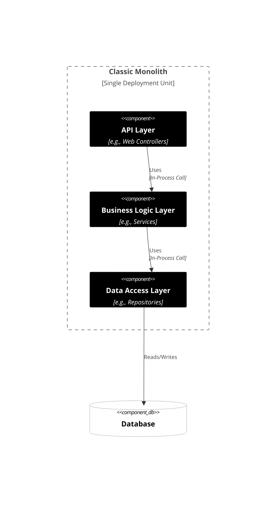
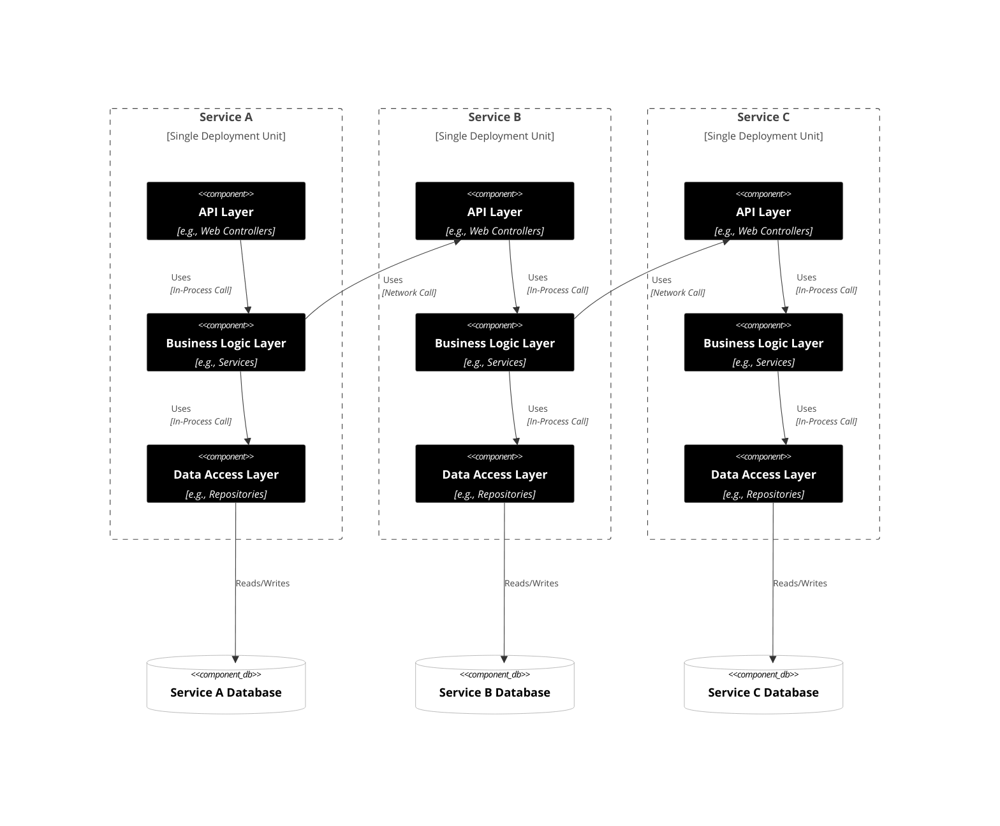
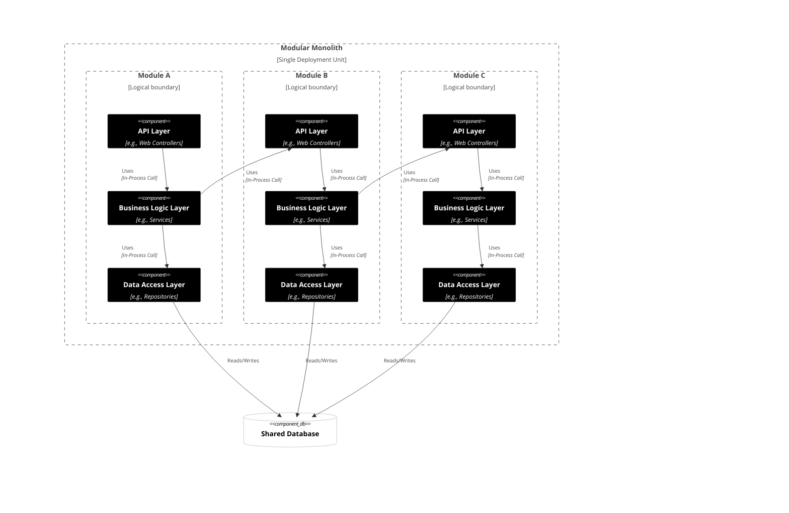

# 🗺️ The Architecture Spectrum: System Evolution

Before we discuss *problems* or *solutions*, let's establish a common, factual vocabulary for three key system architectural styles. We are only looking at the *structure*, not the "why" or "how good."

---

## 1. The Classic Monolith

**Fact:** A single application (one deployment unit) where all code (UI, business logic, data access) runs in a single process. There are no logical boundaries between functionalities.

-----

## 2. Microservices

**Fact:** The application is a collection of small, independent services. Each service is a separate deployment unit, runs in its own process, and typically owns its own database. Communication happens over a network.

-----

## 3. The Modular Monolith

**Fact:** A single application (one deployment unit) where the code is *explicitly* divided into distinct, logical modules (Bounded Contexts). These modules communicate internally via defined interfaces (APIs) or events. Boundaries are *enforced* by code and tests.

-----

## Summary of Facts

| Fact                           | Classic Monolith | Modular Monolith          | Microservices                   |
|:-------------------------------|:-----------------|:--------------------------|:--------------------------------|
| **Deployment**                 | 1 Unit           | 1 Unit                    | Many Units                      |
| **Functionalities Boundaries** | None             | Logical                   | Physical (Network)              |
| **Database**                   | 1 DB             | 1 Shared DB (Can be more) | 1 DB per Service                |
| **Communication**              | In-Process Calls | In-Process Calls/Events   | Over Network (HTTP/gRPC/Events) |
-----

🤔 Where do your current systems sit on this spectrum?

---

    <a href="02-poll.md">◀️</a>
     &nbsp;&nbsp;&nbsp;&nbsp;&nbsp;&nbsp;&nbsp;
    <a href="04-monolith-problems.md">▶️</a>

