# 🧱 Modular Monolith Fundamentals & Key Patterns

The pain points we listed before can be solved in different ways, such as applying a microservices architecture. However, before jumping straight to that solution, it's worth familiarizing ourselves with the modular monolith concept.

## What is a Module? 🤔

* It's **NOT** just a folder, package or namespace\!
* It's a **Bounded Context** (DDD) – a cohesive part of the business domain with its own language.
* Based on **Domain-Driven Design** (DDD, Eric Evans 2003), a Bounded Context defines a specific business area (e.g., Billing, Onboarding, Support) which has its *own* distinct models, language, and rules.
* This is critical because a single business term, like **"Customer"**, means different things in different contexts:
    * **In Billing:** A "Customer" has a `ContractID` and `PaymentStatus`.
    * **In Onboarding:** A "Customer" is a `User` with an `Email` and `IsVerified` status.
    * **In Support:** A "Customer" is a `TicketHolder` with `SupportHistory`.
* The common anti-pattern is forcing all these into one **"God Entity"** (e.g., a single `Customer` class containing all data). This creates high coupling and low cohesion, making the code difficult to develop and maintain.

```mermaid
%%{init: {"theme":"base","themeVariables":{
  "primaryColor":"#FFFFFF",
  "primaryTextColor":"#000000",
  "primaryBorderColor":"#000000",
  "lineColor":"#000000",
  "textColor":"#000000"
}}}%%


graph TD
    subgraph "❌ Bad: Tangled 'God Entity'"
        GodCustomer["Customer<br>ContractID<br>PaymentStatus<br>UserID<br>Email<br>IsVerified<br>TicketID<br>SupportHistory"]
    end

    style BillingCustomer fill:#fff,stroke:#000
    style OnboardingCustomer fill:#fff,stroke:#000
    style SupportCustomer fill:#fff,stroke:#000
    style GodCustomer fill:#ccc,stroke:#000,stroke-width:2px
    
    subgraph "✅ Good: Bounded Contexts"
        direction LR
        subgraph "Billing Context"
            BillingCustomer["Customer<br>ContractID<br>PaymentStatus"]
        end
        subgraph "Onboarding Context"
            OnboardingCustomer["Customer<br>UserID<br>Email<br>IsVerified"]
        end
        subgraph "Support Context"
            SupportCustomer["Customer<br>TicketID<br>SupportHistory"]
        end
    end
```

* **Characteristics of a well-defined module:**
    * 📈 **High Internal Cohesion:** Everything inside serves a single business purpose.
    * 📉 **Low External Coupling:** Knows as little as possible about other modules.
    * 📜 **Explicit Public Contracts:** Clear APIs (e.g., interfaces, DTOs) and Domain Events.
    * 🔐 **Strict Data Ownership:** The module is the *only* owner and manager of its data (tables).

**Boundaries only matter if they are ENFORCED!** (Code + API + Data)

-----

## 🧩 Key Modularization Patterns

Before looking at code, let's learn the thinking tools:

1.  **Shared Kernel:**

    * **What:** Code that can be **safely** shared.
    * **Examples:** Utility libraries (logging, tracing), stable data types (`Money`, `CountryCode`, `UserID`), common technical interfaces (e.g., `EventPublisher`).
    * **Rule:** Must be stable and contain **no module-specific business logic**.

2.  **Explicit API Contracts:**

    * **What:** Modules communicate only through well-defined, narrow interfaces (or events).
    * **Goal:** Hide internal implementation. Changes inside a module shouldn't affect others if the contract holds.
    * **Anti-Pattern:** Injecting a `Repository` or `Service` from another module.

3.  **Event-Driven Integration:**

    * **What:** Modules communicate **asynchronously** by publishing events about what happened (e.g., `OrderPlaced`, `AnalysisCompleted`).
    * **Goal:** Reduce coupling (publisher doesn't know subscribers), improve resilience.
    * **When:** When immediate consistency isn't required or to decouple a long process.

We'll use these patterns to evaluate the code in the next exercise

---

    <a href="04-monolith-problems.md">◀️</a>
     &nbsp;&nbsp;&nbsp;&nbsp;&nbsp;&nbsp;&nbsp;
    <a href="06-code-exercise-intro.md">▶️</a>

