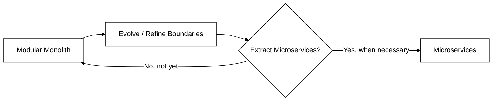
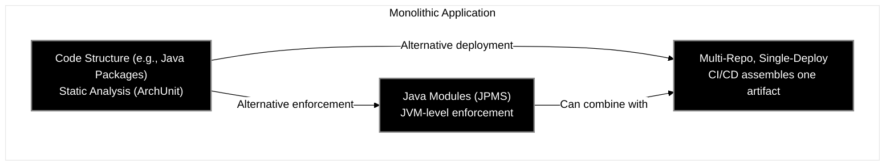
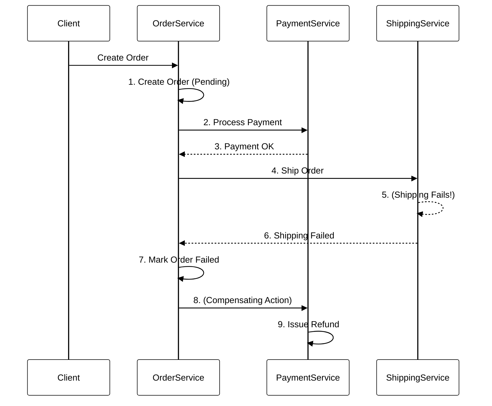
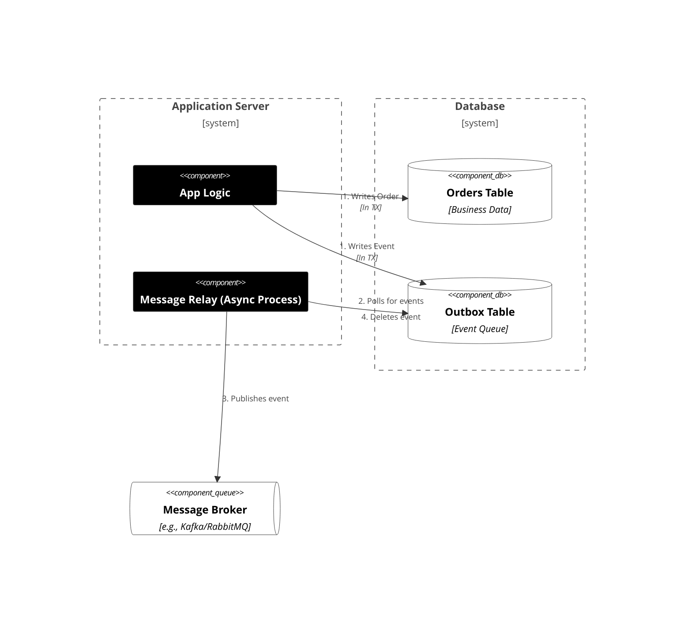

# Slide 12A: But Why Not Microservices??? 🤔

After that refactoring, you might be thinking: "Why not just use microservices?" It's a valid question, but microservices are a solution to a specific set of problems-and they introduce their own, significant complexity.

-----

## 💸 The High Cost of Getting Boundaries Wrong

It's often a costly mistake to start with microservices, especially when business requirements are not well-established and Bounded Contexts are blurry.

Why? **Refactoring a distributed system (microservices) is far more complex** and expensive than refactoring code within a single deployment unit. 🤯

As developer advocate Kelsey Hightower states, the packaging is different from the logic:

> "I recommend keeping your business logic as modular as possible, you can break it up across multiple repos and packages if you really want, but **packaging those components as a monolith offers a serious reduction in complexity** and a simplified deployment and management process."

A common, successful evolution is:

-----

## 🚀 Monoliths are Viable at Scale

Monoliths aren't just for startups. With modern tech, they are more viable than ever.

* **Industry Examples:**
  * **Shopify:** Still runs on a massive, well-structured **Ruby on Rails monolith**, handling billions in commerce. 🛒
  * **GitHub:** Scaled for over a decade on a Rails monolith before *incrementally* and recently beginning to extract services. 🐙
  * **Meta (Facebook) & Netflix:** Both scaled their initial monoliths to a massive size, allowing them to define stable boundaries *before* decomposing them.
  * **Amazon Prime Video:** Famously moved one of their high-scale monitoring services *back* from serverless microservices to a monolith, **reducing their operational costs by 90%.** 📉
    
    This video explains the Amazon Prime Video case study of moving from microservices back to a monolith, which relates to the scalability examples on this slide.
    [Amazon Prime Video's move from Microservices to Monolith](https://www.youtube.com/watch?v=9JPYCOpeDnY)

* **Serverless Support:** Cloud platforms now support **auto-scaling containerized monoliths**, invalidating a classic "must-use-microservices" argument. As Kelsey Hightower notes:
  > "**Serverless monoliths offer a ton of value.** You can avoid the complexity and performance over head of microservices for applications that don't need it, yet get all the benefits of a fully managed platform, and various autoscaling models to fit your needs."

-----

## ⚠️ When are Microservices Unavoidable?

There are, however, "must-have" cases for microservices:

* **Extreme Independent Scaling:** One part of your system (e.g., video encoding) has 1000x the load of another (e.g., billing). 📈
* **Independent, Frequent Deployment:** A specific business unit (e.g., "AI Experiments") *must* be able to deploy 50 times a day without any risk to the core "Billing" system. 🚀
* **Different Tech Stacks:** You *need* to write your ML service in Python, but your core app is in Java. 🐍☕
* **Organizational/Team Boundaries:** You have 20+ teams, and you need to enforce strict organizational separation (Conway's Law). 🧑‍🤝‍🧑
* **Strict Regulatory/Data Sovereignty:** You have a hard legal requirement (like GDPR or data localization laws) to physically host one module's data (e.g., "German User Data") in a specific country, separate from all other data. 📜🔒

-----

## 🛠️ Technical Realizations of a Modular Monolith

There are several ways to implement and enforce modularity within a single monolithic application. The main difference is the strictness of the boundaries.

* **Code Structure (e.g., Java Packages):** This is the most common approach. Modules are separated into distinct packages (or namespaces) within a single codebase. The boundaries are enforced by "social convention" and, more effectively, by automated tools like **ArchUnit (Java)** or **NetArchTest (.NET)**, which run during the build to fail any code that violates the defined dependency rules.
* **Java Modules (JPMS):** This is a formal, JVM-level enforcement mechanism introduced in Java 9. Each module has a `module-info.java` file that explicitly declares what packages it `exports` (its public API) and what other modules it `requires`. This provides strong encapsulation, as the JVM itself will prevent unauthorized access at runtime.
* **Multi-Repo, Single-Deploy:** This is an organizational and CI/CD strategy. Each module lives in its own repository, allowing teams to work independently. However, a central build pipeline pulls these modules together (e.g., as libraries/JARs) and assembles them into a **single deployment artifact** (one `.jar` file, one Docker image). It's still a monolith, just with a distributed source code.

-----

## 🚧 Biggest Challenges When Extracting Microservices

Even with a well-designed modular monolith, extraction can be hard. The main challenge is moving from **in-process** communication and **single database transactions** to a distributed world.

#### 1. The Distributed Transaction Problem (Saga Pattern)

* **Monolith:** A single, atomic database transaction can `create an order` AND `deduct loyalty points`. Easy.
* **Microservices:** This is now **two separate services** with **two separate databases**. A simple transaction is impossible. You must now implement a **Saga**.

A **Saga** is a design pattern for managing data consistency across multiple microservices in the absence of distributed transactions.
 * It's a sequence of **local transactions**. Each local transaction updates the database for a single service and publishes an event to trigger the next step.
 * If a step fails, the saga must execute **compensating actions** to undo the preceding work. For example, if shipping fails, you must issue a refund for the payment that already succeeded.

#### 2. The Atomic Event Publishing Problem (Outbox Pattern)

* **Monolith:** You can use an in-memory event bus. If the database call fails, the event is never sent. Simple.
* **Microservices:** You have a critical problem. What if your service **saves data to the database** (e.g., "Order Created") but then **crashes before sending the event** to Kafka/RabbitMQ? Your database is now out of sync with the rest of the system, and the event is lost forever.

This is the "dual-write" problem, as you cannot atomically commit a transaction to two different systems (your database and a message broker) at the same time.

The **Outbox Pattern** solves this by using the database as a temporary, reliable queue.

1.  The service starts a single, local database transaction.
2.  Within that **same transaction**, it does two things:
  * Writes the business data (e.g., inserts a new row into the `Orders` table).
  * Writes the event (e.g., `OrderCreatedEvent`) into an `Outbox` table *in the same database*.
3.  The transaction is committed. Now, the business change and the event are saved **atomically**.
4.  A separate, asynchronous process (a **Relay** or a change-data-capture (CDC) tool like Debezium) monitors the `Outbox` table.
5.  This relay reads the event from the table, publishes it to the message broker, and (once confirmed) deletes it from the `Outbox`. This ensures the event is sent *at-least-once*, even if the main application crashes.

-----

## ✨ The Modular Monolith: A Strategic Choice

* It's **not** a compromise; it's a **deliberate** architectural choice. ✅
* Solves **internal coupling** problems & code organization within the monolith. 🧩
* Avoids the **operational complexity** of distributed systems (network, deployment, monitoring, data consistency). 🚫
* **Ideal starting point** for many systems – allows for evolution. 🌱

Let's give last word on this slide to Kelsey Hightower:

> "Monolithic applications will be back in style after people discover the drawbacks of **distributed monolithic applications**."

-----

    <a href="12-redesign-lessons.md">◀️</a>
     &nbsp;&nbsp;&nbsp;&nbsp;&nbsp;&nbsp;&nbsp;
    <a href="14-case-study-heet.md">▶️</a>

