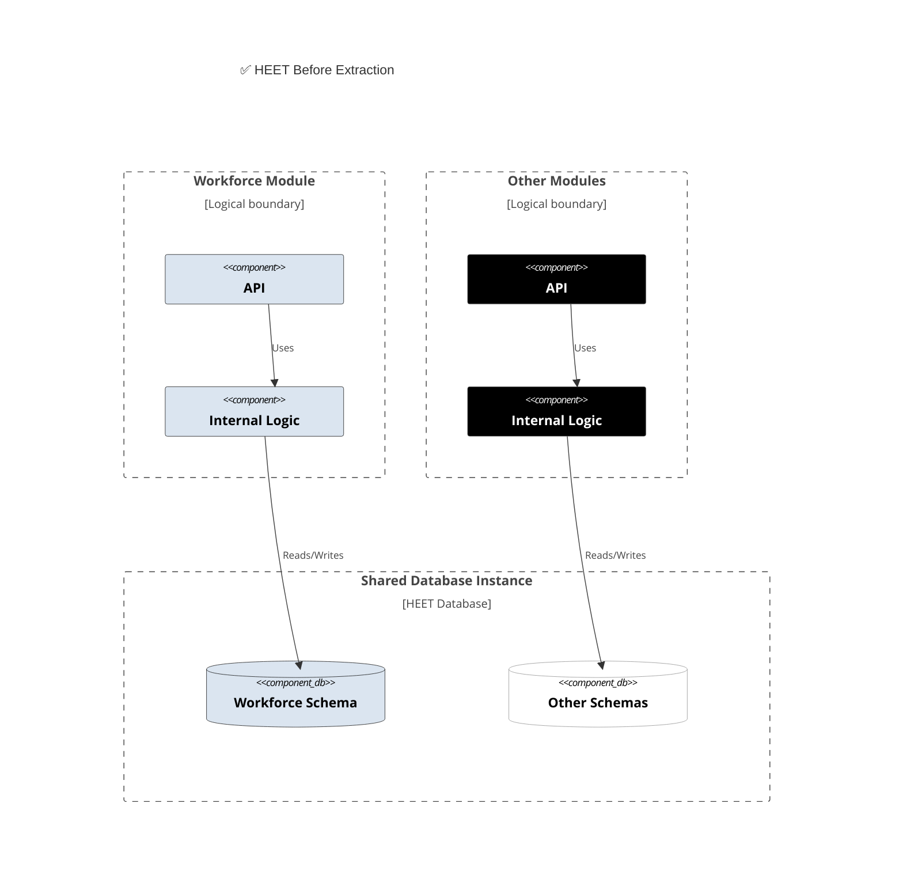
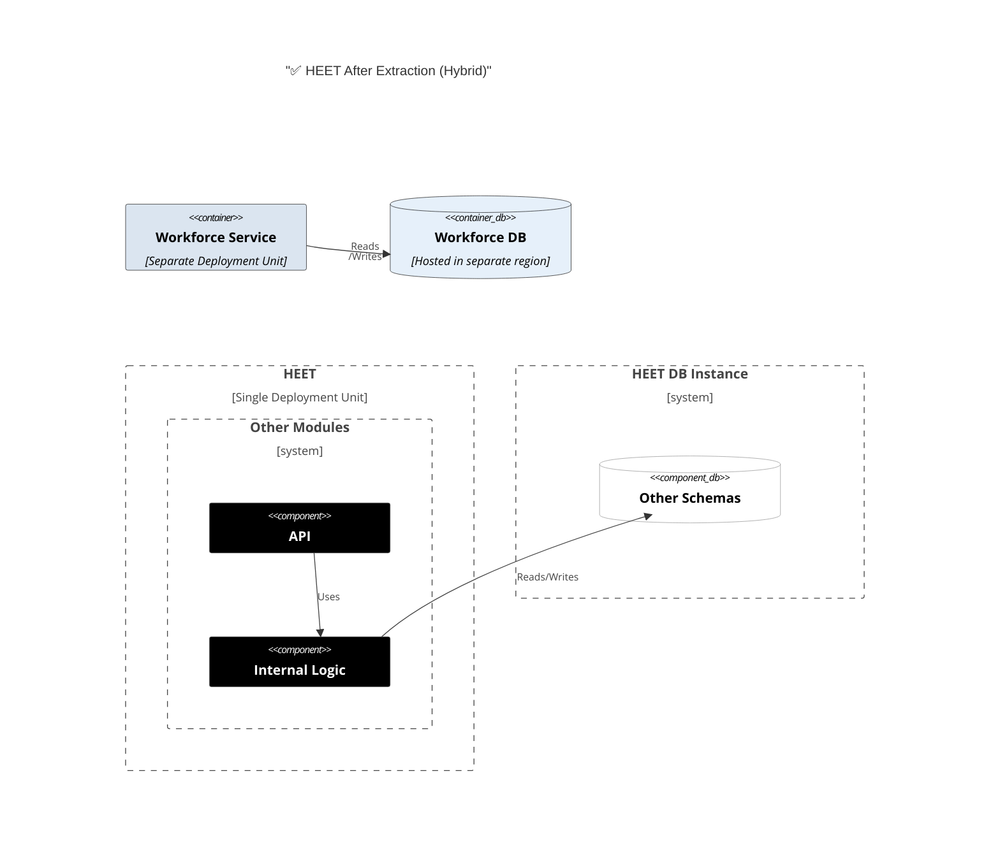

# 🚀 Case Study: HEET – A Modular Monolith in Production (HSBC)

Theory is good, examples from well known companies too, but it is always the best to see that this architecture works in our company.

**HEET:** An internal HSBC platform that provides insights and metrics for all phases of SLDC in HSBC.

* **Architecture:** Designed as a **Modular Monolith** from the start, leveraging CQRS pattern.
* **Modules (Domain-Oriented):**
    * `Employees`
    * `Changes` 
    * `Applications` 
    * `Source code`
    * `Workforce` (HR Data - **Important!**)
    * ...and others.
  
This diagram shows the initial state. The modules (Workforce and "Other Modules") are logically separate inside the monolith. Crucially, they do not share data; each module's logic only accesses its own schema within the shared database instance

---

## Scenario: `Workforce` Module Extraction 🌍

**Business/Regulatory Challenge:**

* `Workforce` module contained sensitive data.
* Before production deployment, requirements emerged for **data residency** and visa restrictions in certain regions.
* **Need:** Extract `Workforce` into a separate, independently deployable service hosted in a different place.

**How did the extraction go?**

* ✅ **Smoothly and painlessly!**

**Why was this possible? Because it was a *well-designed* modular monolith from the start:**

1.  🔐 **Full Data Ownership:** `Workforce` was the sole module writing/modifying its own tables.
2.  ❌ **No Cross-Module DB Joins:** Even though `Workforce` tables contained employees' data, they didn't refer to `Employee` tables.
3.  📜 **Clear APIs & Contracts:** Communication boundaries were well-defined.

Because the boundaries were clean, the Workforce module (code + schema) could be lifted out and deployed as a new, separate service. The other modules' in-process calls were simply replaced with network calls (API) to the new service.

**Conclusion:** ✨

> The Modular Monolith **enables evolution**. It offers initial speed and simplicity but **keeps the door open** for targeted microservice extractions when (and *if*) a real business, regulatory, or scalability need arises.

---

    <a href="13-why-not-microservices.md">◀️</a>
     &nbsp;&nbsp;&nbsp;&nbsp;&nbsp;&nbsp;&nbsp;
    <a href="15-evolution-conway.md">▶️</a>

