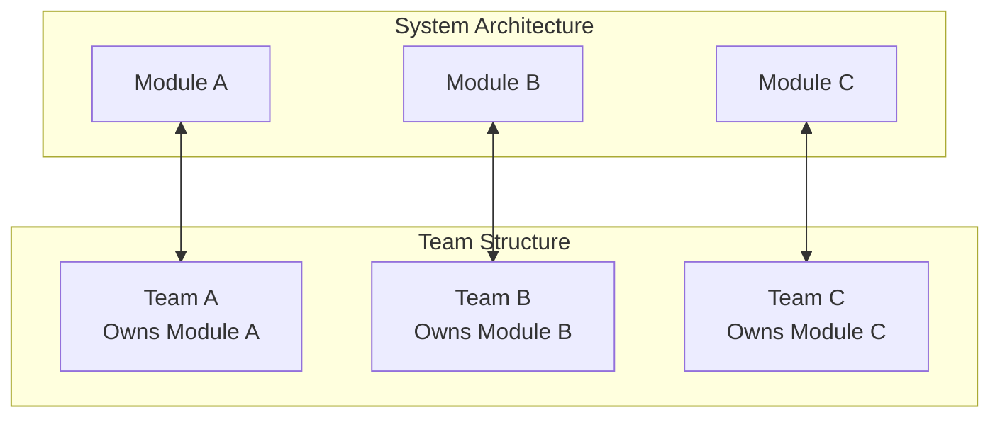

# 🌱 Evolution, Organization & CI/CD

## Conway's Law: Architecture Mirrors Communication 

> "Organizations which design systems (...) are constrained to produce designs which are copies of the communication structures of these organizations." - Melvin Conway, 1968

**What does this mean for us?**

* If we have a tangled monolith, we likely have "tangled" teams with unclear responsibilities.
* **Strategy:** Align team structure with module boundaries! 🧩

**Benefits:**

* ✅ **Autonomy & Ownership:** Teams are responsible for their modules end-to-end.
* ⬇️ **Reduced Communication Overhead:** Changes in Module A are less likely to require coordination with Team B.
* 🚀 **Faster Delivery:** Independent teams can work in parallel.

-----

## ⚙️ CI/CD Implications

* **Remember:** A modular monolith is **still ONE deployment unit**. We build and deploy the whole thing together.
* **BUT... The pipeline can be smarter!**
    * We can optimize the testing phase – run tests only for modules that **actually changed** (and their direct dependents).
    * Faster feedback for developers! ⚡
